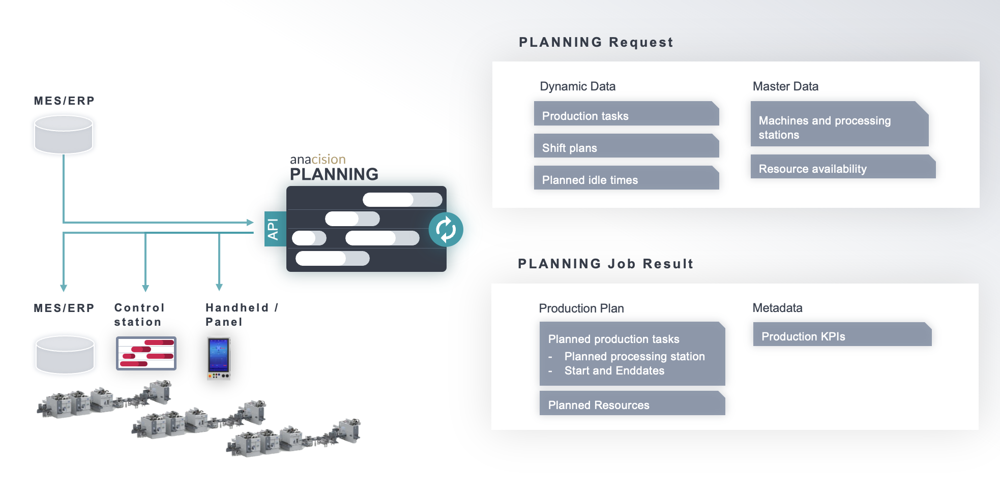

# About anacision PLANNING

anacision PLANNING is a light-weight advanced planning and scheduling (APS) solution. It determines
an automated allocation of production demands and production capacities. anacision PLANNING generates 
optimal production plans that answer the following question:

* What needs to be produced...
  * on which machines...
  * by which personnel...
  * using which equipment...
  * to meet the production goals?

Examples of production goals are equipment utilization, staff utilization or on-time delivery.
A more detailed discussion of how to work with the production goals can be found in the [user guide](../user_guide/user_guide.md#production_goals).


The plans are generated by a cloud-based service that runs a high-performance genetic algorithm. To access
this service, anacision PLANNING provides a standardized, well documented REST API (which can be accessed at 
[https://planning.anacision.ai/](https://planning.anacision.ai/)).

The API can receive planning requests to return optimized schedules (see [usage](#usage)) and can easily be integrated into existing
software such as ERP or MES systems.

## Usage

Generating a production plan with anacision PLANNING requires three steps:
1. Creating a PLANNING request json. 
2. Posting the PLANNING request json to the [API](https://planning.anacision.ai/), which is then optimized by the PLANNING algorithm.
3. Getting the PLANNING job result.


*Illustration of a possible end to end integrated planning process.*


### 1. Creating a PLANNING request

The PLANNING request is the input for each planning job. It is a JSON object that 
is based on a standardized data model. Since the cloud-based service is stateless, 
each request needs to provide all information that is relevant 
for creating a production plan. This includes master data (such as available machines or processing options),
as well as dynamic
data (such as production quantity, demand or due dates).


#### Required input data

This section gives a high-level overview of the required data. Refer to the 
[technical API documentation](https://planning.anacision.ai/docs) for a detailed 
description of the whole data model.

* **Open production tasks**: Production tasks that need to be fulfilled. They can be based on client orders or warehouse orders. 
 If there are multiple processing steps within an order, each step needs to be specified as a task. They can be linked
 through predecessor relationships. The task is mainly characterized through:
    * Unique id for distinction between tasks
    * Earliest date after which the task can start
    * If applicable: Predecessor tasks that have to be processed directly before this task
    * Due date by which the task needs to be finished
    * Which station can process the task? (OR which capability is required to process this task?)
    * Processing time on all stations that can process the task
    * If applicable: which resources are needed to produce the task?
* **Processing stations**: Smallest production unit to which production tasks are assigned. It can be one machine, several machines, a manual workstation or a combination of all. The station is mainly characterized through:
    * Availability intervals during which the station can process tasks
    * Planned downtimes during which the station is not available (e.g. for inspection)
* **Limited resources**: Resources can be modeled to avoid the same resource being planned for more than its availability. The resources can be equipment, tools or personnel.
    * Number of available units for each resource (e.g. one small drill, two large drills)
    * If applicable: shift times during which the resource is available. This is especially
    relevant for scheduling personnel. They can also be used to model set up tasks between the processing tasks.
    * If applicable: required resources to perform setup changes
    * Changeover matrices: Time to change from one resource to another within a resource type. 

### 2. Posting a PLANNING job to the queue
The PLANNING request json can be posted to the PLANNING API through the endpoint ```POST/planning-job```.
The endpoint parses and validates the request and creates a PLANNING job. The API is connected to a queue 
where the jobs are being executed one after the other. The posted job is added to the queue
and will be processed as soon as a computing resource becomes available. Upon posting,
the endpoint returns a ```job_id``` which is a unique identifier for the PLANNING job. It 
can be used to check the status of a job and to retrieve the job result once the job has
been processed successfully. The endpoint also executes a thorough validation of the input format
and returns meaningful error messages if the format is invalid (e.g. a task is assigned a station that
has not been defined or has predecessors that are unknown).


### 3. Getting the PLANNING job result

The result of a PLANNING job can be retrieved by its ```job_id```through the endpoint ```GET/planning-job{job_id}```.

It is again a structured json format which includes the optimized production plan.
It can be retrieved by the job id and contains the following information:

* Planned production and setup tasks
    * Planned startdate and -time
    * Planned enddate and -time
    * Planned station
    * Used resources and equipment
* Production KPis, e.g.
    * Tardiness
    * Makespan
    * Machine utilization
    * Changeover duration


